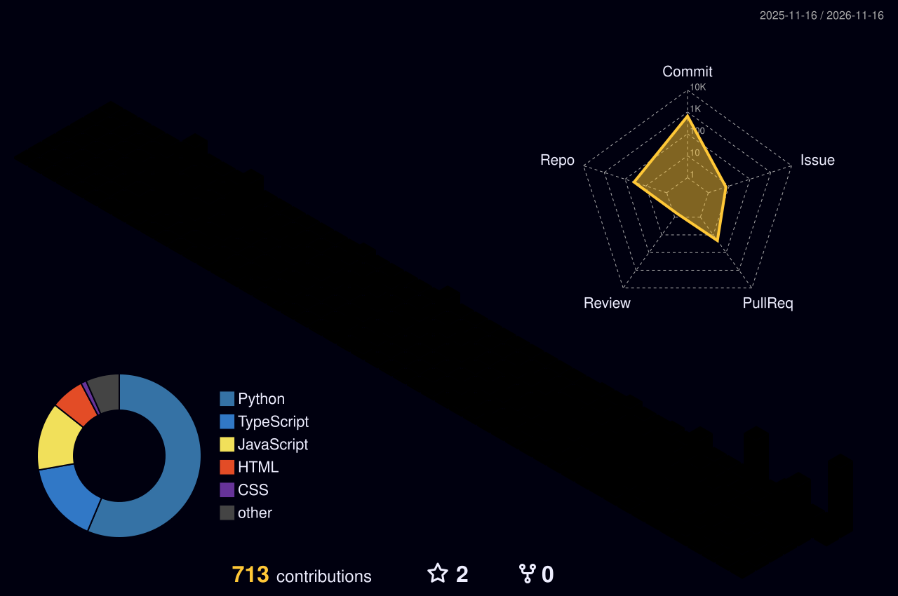

<table>
<tr>
<td valign="top" width="58%">
</td>
<td valign="top" width="42%" align="right">

</td>
</tr>
</table>

### `$ ./contributions.sh`

Want the <b>interactive</b> one? <a href="https://tohraan.github.io/#graph">Hover any day, click it to jump to that day's commits, replay the animation →</a>

How the graph is made

The first commits in <a href="https://github.com/tohraan/cse-lab">cse-lab</a> were backfilled with
<code>tools/build_history.py</code>, so their dates are planned rather than the day the code was first typed.
Every problem in that repo is real, tested code, and a daily workflow now releases new commits with their real dates.
The generator and the grid layout are in that repo's <code>tools/</code> folder.

### `$ whoami`

<table>
  <tr>
    <td valign="top"></td>
    <td valign="top"></td>
  </tr>
</table>

### `$ cat stack.txt`

 

### `$ ls projects/`

### `$ ./snake.sh`

<picture>
  <source media="(prefers-color-scheme: dark)" srcset="https://raw.githubusercontent.com/tohraan/tohraan/output/github-snake-dark.svg" />
  <source media="(prefers-color-scheme: light)" srcset="https://raw.githubusercontent.com/tohraan/tohraan/output/github-snake.svg" />
  
</picture>

### `$ tail -f activity.log`

<!--START_SECTION:activity-->
1. 🔒 Closed issue [#17](https://github.com/tohraan/pr-lab/issues/17) in [tohraan/pr-lab](https://github.com/tohraan/pr-lab)
2. ❗ Opened issue [#17](https://github.com/tohraan/pr-lab/issues/17) in [tohraan/pr-lab](https://github.com/tohraan/pr-lab)
3. 🎉 Merged PR [#16](https://github.com/tohraan/pr-lab/pull/16) in [tohraan/pr-lab](https://github.com/tohraan/pr-lab)
4. 💪 Opened PR [#16](https://github.com/tohraan/pr-lab/pull/16) in [tohraan/pr-lab](https://github.com/tohraan/pr-lab)
5. 🎉 Merged PR [#15](https://github.com/tohraan/pr-lab/pull/15) in [tohraan/pr-lab](https://github.com/tohraan/pr-lab)
<!--END_SECTION:activity-->

